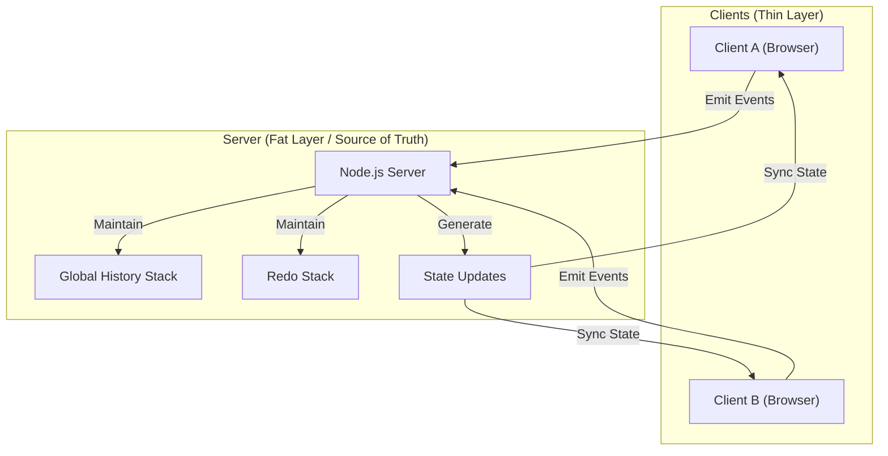

# 🎨 Collaborative Drawing Architecture

## 1. System Overview

This project is a real-time, multi-user drawing application based on a **Client–Server Architecture**. It uses **WebSockets** for bi-directional communication and a **Centralized State Management Pattern** to maintain a consistent drawing state across all connected clients.

The server acts as the **single source of truth**, while clients are responsible only for rendering.

---

## 🏛 High-Level Architecture Diagram

The system follows a **“Thin Client, Fat Server”** model:

- **Client:** UI rendering and input capture
- **Server:** State management, synchronization, and conflict resolution



---

## 2. Data Flow & Synchronization Strategy

### A. The **Stroke** Data Model (Vector Storage)

Instead of sending bitmap pixel data, the application transmits **vector paths**.
Each drawing action is represented as a **Stroke**, which is a collection of points with style properties.

```json
{
  "color": "#FF0000",
  "size": 5,
  "points": [
    { "x": 100, "y": 100 },
    { "x": 105, "y": 102 }
  ]
}
```

| Event Name       | Direction       | Payload              | Purpose                                                             |
| ---------------- | --------------- | -------------------- | ------------------------------------------------------------------- |
| `connection`     | Client → Server | –                    | Establishes the socket connection.                                  |
| `new-user`       | Client → Server | `String` (Name)      | Registers the user and assigns a unique color.                      |
| `drawing-live`   | Bidirectional   | `{ x0, y0, x1, y1 }` | Streams temporary stroke movement for real-time preview. Not saved. |
| `drawing-save`   | Client → Server | `Stroke Object`      | Finalized stroke sent on mouseup, saved in global history.          |
| `cursor-move`    | Bidirectional   | `{ id, x, y }`       | Syncs ghost cursors of other users.                                 |
| `undo` / `redo`  | Client → Server | –                    | Requests a state change from the server.                            |
| `history-update` | Server → Client | `Array<Stroke>`      | Sends the authoritative state for full canvas re-rendering.         |

---

## 3. State Management (Global Undo / Redo)

We use a **Global State Replacement Strategy** to ensure perfect synchronization.

The server maintains:

- **drawingHistory** → Active stack of strokes
- **redoStack** → Stack of undone strokes

Undo Flow:

1. User clicks **Undo**
2. Server moves the last stroke from **drawingHistory** to **redoStack**
3. Server emits **history-update**
4. Clients clear the canvas and re-render all strokes

---

## 4. Conflict Resolution & Concurrency

1. Node.js processes all events sequentially
2. The server defines stroke order
3. The redo stack is cleared when a new stroke is added after undo

This prevents timeline branching and inconsistencies.

---

## 5. Design Principle

> **Clients render. Server decides. History is absolute.**
